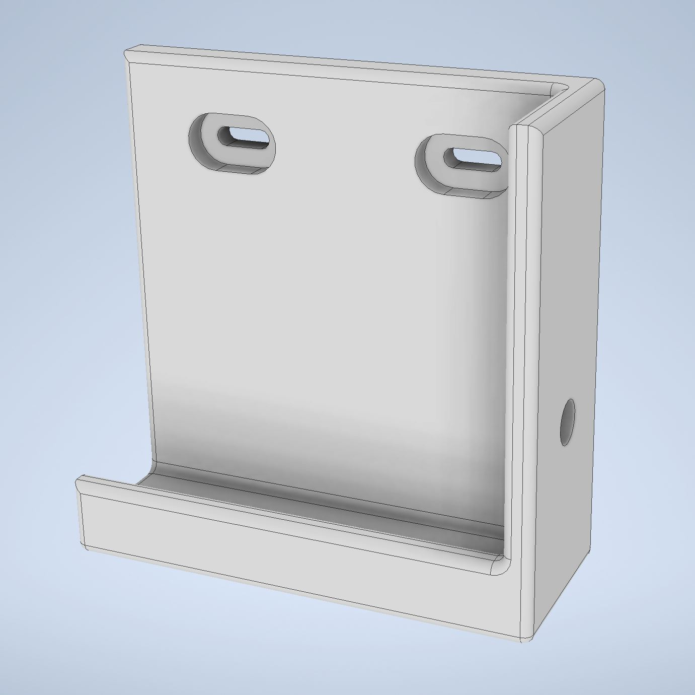
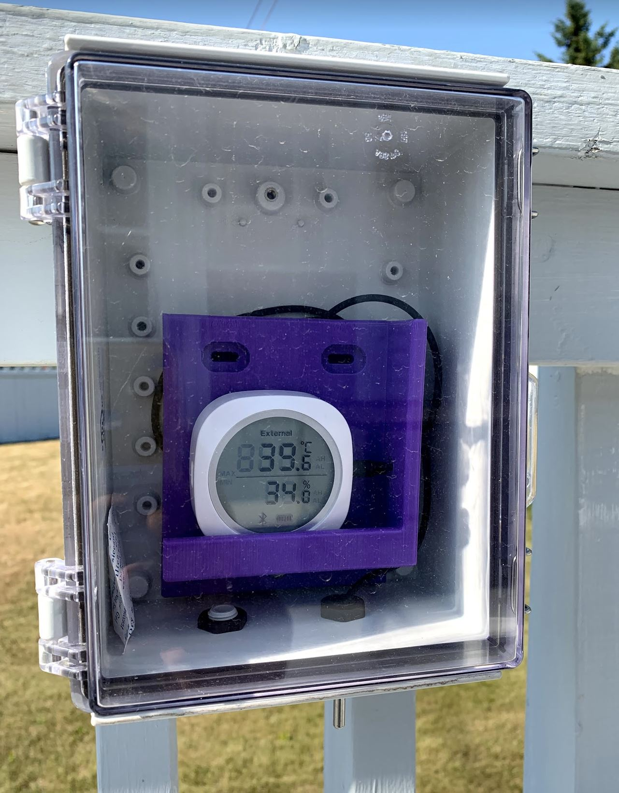
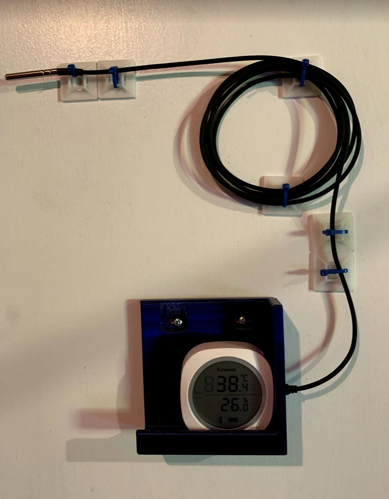

# Temperature-Sensor-Shelf
 A 3D-printed temperature sensor mounting shelf

## Purpose
CAD design files are provided to create a shelf that holds a temperature sensor
inside of an enclosure or on a wall.  An alternative version of the design is
also provided with a mounting hole.

## Rendered 3D View

## Shelf Deployed in Enclosure

## Shelf Deployed on Wall

## Built With

 * Autodesk Inventor

## Contributing

 Please contact the author to contribute or to suggest modified versions.

## Authors

 * **Nicholas J. Kinar** - *Initial work* - 3D model

## License

 This project is licensed under the MIT License - see the [LICENSE.md](LICENSE.md) file for details

## Acknowledgments

 * Autodesk for the Inventor Professional software license for education
 * Full Deck Visuals (Saskatoon, Saskatchewan, Canada) for the image
